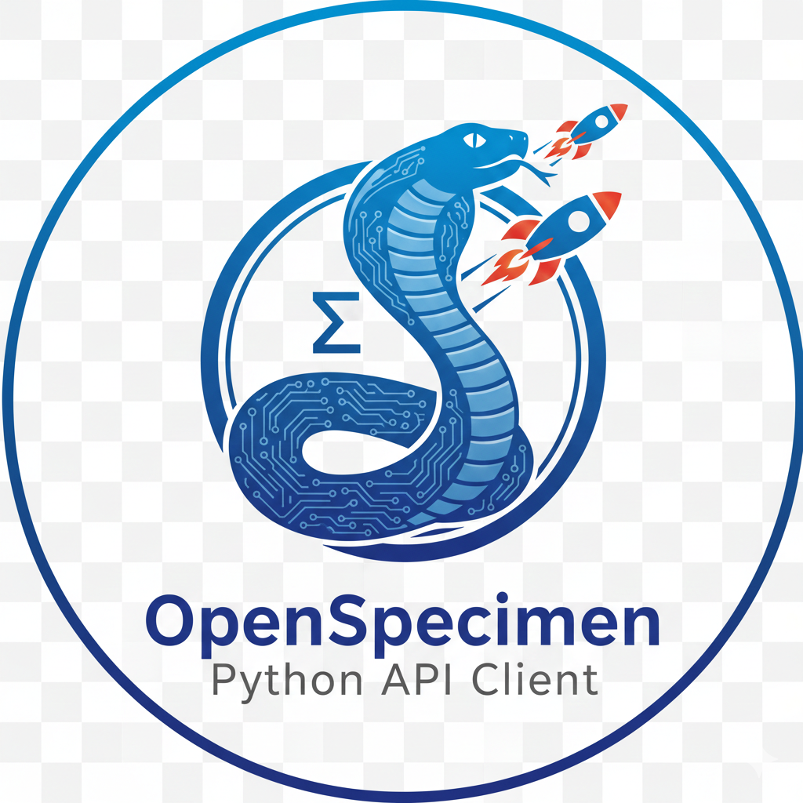

# OpenSpecimen Python API Client 🚀🐍

  

A lightweight Python client for interacting with the OpenSpecimen REST API.  
This project is a clean and Pythonic rewrite of an auto‑generated C# NSwag client.

✨ Supports  
- 🔐 Session authentication (`/sessions`)  
- 📡 Executing AQL queries (`/query`)  
- ⚡ Modern HTTP handling with `httpx`  
- 🧰 Clear error handling  
- 📦 Simple integration into existing Python projects  

Licensed under the MIT License.

---

## ⭐ Features

- 🧼 Clean and readable API  
- 🪪 Automatic session token management  
- 🧪 Execute complex AQL queries with ease  
- 🍃 Minimal dependencies  
- 🔌 Easily extendable  
- 🛟 Helpful exception messages (with HTTP status + body)  

---

## 📦 Installation

Install the only required dependency:

bash
pip install httpx

Add the `client.py` and `api_query.py` files to your project, or install via pip once packaged.

---

## 📁 Project Structure

.
├── client.py        # Low-level HTTP and JSON handling
└── api_query.py     # High-level API wrapper with session handling

---

## 🚀 Quick Start

Authenticate and run a query in just a few lines:

python
from api_query import ApiQuery

session_info = {
    "loginName": "admin",
    "password": "secret",
    "domainName": "openspecimen"
}

api = ApiQuery(
    base_url="https://your.openspecimen.server/openspecimen",
    session_info=session_info
)

query = {
    "aql": "select cp.shortTitle from Participant p",
    "cpId": "123"
}

response = api.execute_query(query)
print(response)

---

## 🧩 Using the low-level Client class directly

If you prefer more control:

python
from client import Client

client = Client("https://your.openspecimen.server/openspecimen")

session_response = client.set_session({
    "loginName": "admin",
    "password": "secret",
    "domainName": "openspecimen"
})

api_token = session_response["token"]

result = client.execute_query(
    {"aql": "select id from Participant p"},
    api_token
)

print(result)

---

## ⚠️ Error Handling

All non‑200 responses raise an `ApiException`.  
It includes:

- HTTP status code  
- Response body  
- Headers  

Example:

python
try:
    result = api.execute_query(query)
except ApiException as ex:
    print("API Error:", ex)

---

## 🗺️ Roadmap

Planned improvements:

- 🌀 Async client with `httpx.AsyncClient`
- 🧾 Pydantic models for request/response validation
- 📦 PyPI packaging
- 🧪 Test suite with pytest
- 🔄 Query helper functions

---

## 🤝 Contributing

Contributions are welcome!  
Please open an issue or submit a pull request.

---

## 📜 License

MIT License — you’re free to use, modify, and share this project.

---